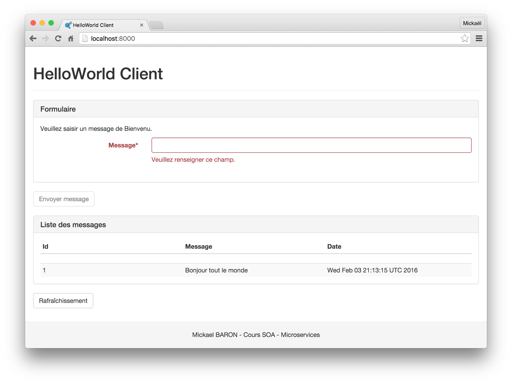

Example of architecture based on microservices for building a simple HelloWorld application. Below is a screenshot of the main user interface.

Scenario is obvious: you input a HelloWorld message and you submit it. All the HelloWorld messages are listed into a table.



The architecture of this application is composed of five microservices.

* The **Web** microservice to supply user interface (_helloworldwebmicroservice_ project). Technologies: HTML,JavaScript and Node.JS
* The **Rest** microservice (_helloworldrestmicroservice_ project) to supply a REST API. Technologies: Java, RabbitMQ client, JRedis, KumuluzEE, CDI and JAX-RS.  
* The **Redis** microservice to store data. Technology: Redis server.
* The **RabbitMQ** microservice to store event bus. Technology: RabbitMQ server.
* The **Log** microservice (_helloworldlogmicroservice_ project) to create logs. Technology: Java, RabbitMQ client.

# Prerequisites

* Docker (latest version)
* Docker Compose (latest version)

# How to Run

Clone this project.

At the root of the project execute the following shell command.

```shellscript
$ docker-compose up -d
```

After the local deployment, you can check if the docker containers are working.

```shellscript
$ docker-compose ps
```

# How to exec

Open your favorite web browser and go to this URL: http://localhost

To check if the **Log** microservice is working, display its console output

```shellscript
$ docker logs log_1
```
